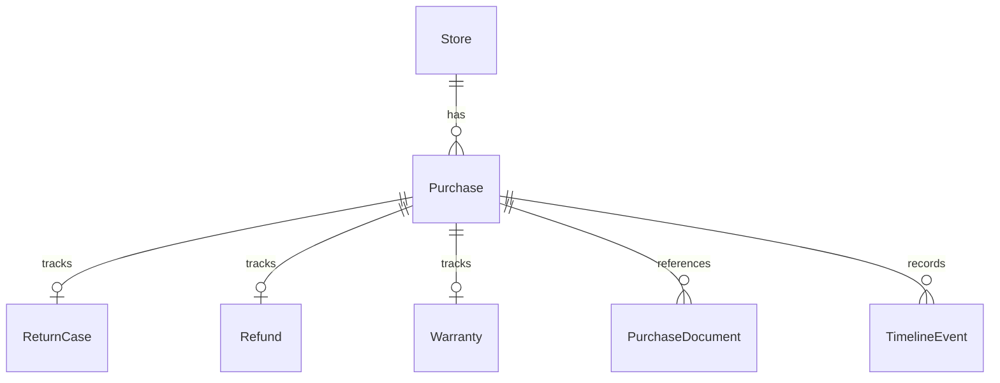

# AfterBuy — Data Model

**Status:** Draft 1.0  
**Repository path:** `docs/architecture/data-model.md`  
**Related documents:**
- `docs/product/project-charter.md`
- `docs/product/feasibility-study.md`
- `docs/product/mvp-scope.md`
- `docs/product/user-journey.md`
- `docs/architecture/overview.md`
- `docs/architecture/backend.md`
- `docs/architecture/testing.md`

---

## 1. Purpose

This document defines the **MVP data model** for AfterBuy.

AfterBuy is a lightweight full-stack product. The data model must be realistic enough to support persistence, validation, business logic, dashboard queries and lifecycle updates, but small enough to avoid turning the MVP into a backend-heavy platform.

The model supports the core journey:

```txt
add a purchase
  → persist purchase and lifecycle records
  → calculate return and warranty deadlines
  → surface urgent actions
  → update return/refund/warranty status
  → record lifecycle timeline events
```

The model should communicate backend awareness, not backend overengineering.

---

## 2. Conceptual data model

At a conceptual level, AfterBuy is centered around a **Purchase**.

A purchase belongs to a **Store** and owns the lifecycle records that make the product valuable:

- return tracking;
- refund tracking;
- warranty tracking;
- document/reference metadata;
- timeline events.

Recommended relationship shape:

```txt
Store
  └── has many Purchases

Purchase
  ├── belongs to one Store
  ├── has one ReturnCase
  ├── has one Refund
  ├── has one Warranty
  ├── has many PurchaseDocuments
  └── has many TimelineEvents
```

The model intentionally does **not** include users, authentication, roles, tenants, file storage, OCR jobs, notifications or external merchant integrations in the MVP.

---

## 3. MVP entities

The MVP should include these persisted entities:

| Entity | Purpose | MVP role |
| --- | --- | --- |
| `Store` | Merchant or retailer where the item was purchased. | Enables filtering, default return policies and support metadata. |
| `Purchase` | Core purchase record. | Central aggregate for the post-purchase lifecycle. |
| `ReturnCase` | Return window and return status for a purchase. | Enables return deadline calculation and urgent return actions. |
| `Refund` | Refund state after a return or claim. | Enables pending refund detection. |
| `Warranty` | Warranty duration and expiration state. | Enables warranty expiration tracking. |
| `PurchaseDocument` | Metadata/mock reference for receipts, invoices, manuals or support links. | Enables missing receipt and support/manual states without real uploads. |
| `TimelineEvent` | Lifecycle event generated by mutations. | Makes the detail page explain what happened over time. |

These entities are enough to prove the full product slice while keeping the backend bounded.

---

## 4. Future / non-MVP entities

These entities should not be implemented in the MVP. They can be documented in the roadmap only.

| Future entity | Why it is not MVP |
| --- | --- |
| `User` | Authentication and accounts are explicitly out of scope. |
| `Household` / `FamilyAccount` | Multi-user sharing adds authorization and collaboration complexity. |
| `UploadedFile` | Real file upload/storage is out of scope; documents are metadata only. |
| `OcrJob` | OCR introduces async processing and external services. |
| `EmailImport` | Gmail/Outlook parsing would shift the project toward integrations. |
| `MerchantIntegration` | Amazon/Zalando/Apple/PayPal integrations are not needed for the core journey. |
| `Notification` | Background reminders, queues and cron jobs are out of scope. |
| `WarrantyClaim` | Could be useful later, but the MVP only tracks warranty status. |
| `CalendarReminder` | Calendar integration is future scope. |
| `Subscription` / `Payment` | No payment or SaaS monetization in the MVP. |
| `AuditLog` | Timeline events are enough for product-visible history. |
| `Tenant` / `Organization` | Multi-tenant architecture is explicitly out of scope. |

---

## 5. Entity fields

### 5.1 `Store`

Represents the merchant or retailer.

| Field | Type | Required | Notes |
| --- | --- | --- | --- |
| `id` | `string` | Yes | CUID/UUID. |
| `name` | `string` | Yes | Display name, unique enough for MVP. |
| `websiteUrl` | `string?` | No | Optional merchant website. |
| `supportUrl` | `string?` | No | Optional support link. |
| `defaultReturnPolicyDays` | `number?` | No | Used as default when creating purchases. |
| `createdAt` | `Date` | Yes | Audit timestamp. |
| `updatedAt` | `Date` | Yes | Audit timestamp. |

Relationships:

- one store has many purchases.

MVP notes:

- store creation can happen implicitly from the purchase form;
- no advanced store management screen is required;
- store category/tags are not required in MVP.

---

### 5.2 `Purchase`

Represents the item or order the user wants to track.

| Field | Type | Required | Notes |
| --- | --- | --- | --- |
| `id` | `string` | Yes | CUID/UUID. |
| `productName` | `string` | Yes | Main product label shown in UI. |
| `category` | `PurchaseCategory` | Yes | Used for filters and screenshots. |
| `priceCents` | `number` | Yes | Store money as integer cents, not floating point. |
| `currency` | `Currency` | Yes | Default `EUR` for MVP. |
| `purchaseDate` | `Date` | Yes | Treated as calendar date. |
| `orderNumber` | `string?` | No | Optional order/reference number. |
| `notes` | `string?` | No | Lightweight user notes. |
| `storeId` | `string` | Yes | Foreign key to `Store`. |
| `createdAt` | `Date` | Yes | Audit timestamp. |
| `updatedAt` | `Date` | Yes | Audit timestamp. |

Relationships:

- belongs to one store;
- has one return case;
- has one refund record;
- has one warranty record;
- has many purchase documents;
- has many timeline events.

MVP notes:

- `Purchase` should remain focused on core purchase data;
- lifecycle-specific fields should live in `ReturnCase`, `Refund` and `Warranty`;
- do not add user/account ownership yet.

---

### 5.3 `ReturnCase`

Represents return tracking for a purchase.

| Field | Type | Required | Notes |
| --- | --- | --- | --- |
| `id` | `string` | Yes | CUID/UUID. |
| `purchaseId` | `string` | Yes | One-to-one relation with `Purchase`. |
| `returnPolicyDays` | `number` | Yes | Number of days from purchase date. Can be `0`. |
| `returnDeadline` | `Date?` | Yes for normal flow | Calculated server-side from purchase date and policy days. |
| `status` | `ReturnStatus` | Yes | Default `not_planned`. |
| `plannedAt` | `Date?` | No | Optional date when user planned the return. |
| `returnedAt` | `Date?` | No | Date item was actually returned. |
| `closedAt` | `Date?` | No | Optional closure date. |
| `createdAt` | `Date` | Yes | Audit timestamp. |
| `updatedAt` | `Date` | Yes | Audit timestamp. |

Relationships:

- belongs to one purchase.

MVP notes:

- return deadline is calculated by domain logic, not manually entered as source of truth;
- `return_window_expired` can be derived at read time or persisted when status is explicitly updated;
- do not model shipping labels, return carriers or tracking codes in MVP.

---

### 5.4 `Refund`

Represents refund tracking after a return or issue.

| Field | Type | Required | Notes |
| --- | --- | --- | --- |
| `id` | `string` | Yes | CUID/UUID. |
| `purchaseId` | `string` | Yes | One-to-one relation with `Purchase`. |
| `status` | `RefundStatus` | Yes | Default `not_expected`. |
| `expectedRefundCents` | `number?` | No | Defaults to purchase price when relevant. |
| `refundRequestedAt` | `Date?` | No | Used to detect pending refund duration. |
| `refundedAt` | `Date?` | No | Date refund was received. |
| `createdAt` | `Date` | Yes | Audit timestamp. |
| `updatedAt` | `Date` | Yes | Audit timestamp. |

Relationships:

- belongs to one purchase.

MVP notes:

- no real payment provider or bank integration;
- pending refund detection is based on dates and status;
- refund amount can be optional for MVP.

---

### 5.5 `Warranty`

Represents product warranty tracking.

| Field | Type | Required | Notes |
| --- | --- | --- | --- |
| `id` | `string` | Yes | CUID/UUID. |
| `purchaseId` | `string` | Yes | One-to-one relation with `Purchase`. |
| `durationMonths` | `number?` | No | Warranty duration from purchase date. Can be `0`. |
| `expiresAt` | `Date?` | No | Calculated from purchase date and duration. |
| `status` | `WarrantyStatus` | Yes | Default can be derived from duration. |
| `createdAt` | `Date` | Yes | Audit timestamp. |
| `updatedAt` | `Date` | Yes | Audit timestamp. |

Relationships:

- belongs to one purchase.

MVP notes:

- `active`, `expiring_soon` and `expired` can be derived from `expiresAt` and current date;
- persist a status for clear UI and easier demo data, but keep derivation logic testable;
- warranty claims are future scope.

---

### 5.6 `PurchaseDocument`

Represents metadata or mock references for receipts, invoices, manuals and support links.

| Field | Type | Required | Notes |
| --- | --- | --- | --- |
| `id` | `string` | Yes | CUID/UUID. |
| `purchaseId` | `string` | Yes | Many-to-one relation with `Purchase`. |
| `type` | `DocumentType` | Yes | `receipt`, `invoice`, `manual`, `support_link`, `other`. |
| `label` | `string?` | No | User-facing label. |
| `isAvailable` | `boolean` | Yes | Whether the reference exists. |
| `referenceUrl` | `string?` | No | Optional mock URL/reference. No real upload. |
| `createdAt` | `Date` | Yes | Audit timestamp. |
| `updatedAt` | `Date` | Yes | Audit timestamp. |

Relationships:

- belongs to one purchase.

MVP notes:

- do not store files;
- do not model cloud paths, MIME types, storage buckets or OCR status;
- missing receipt logic should check document metadata, not files.

---

### 5.7 `TimelineEvent`

Represents a product-visible lifecycle event.

| Field | Type | Required | Notes |
| --- | --- | --- | --- |
| `id` | `string` | Yes | CUID/UUID. |
| `purchaseId` | `string` | Yes | Many-to-one relation with `Purchase`. |
| `type` | `TimelineEventType` | Yes | Event category. |
| `title` | `string` | Yes | Display title. |
| `description` | `string?` | No | Optional detail. |
| `occurredAt` | `Date` | Yes | When the lifecycle event happened. |
| `createdAt` | `Date` | Yes | When the event was persisted. |

Relationships:

- belongs to one purchase.

MVP notes:

- timeline events should be generated by Server Actions, not by React components;
- timeline is product UX, not a full technical audit log;
- free-form notes can be represented as `note_added` events.

---

## 6. Relationships

### 6.1 Relationship summary

| From | To | Type | Notes |
| --- | --- | --- | --- |
| `Store` | `Purchase` | One-to-many | Store owns many purchases. |
| `Purchase` | `ReturnCase` | One-to-one | Created together with purchase. |
| `Purchase` | `Refund` | One-to-one | Created together with purchase. |
| `Purchase` | `Warranty` | One-to-one | Created together with purchase. |
| `Purchase` | `PurchaseDocument` | One-to-many | Metadata references only. |
| `Purchase` | `TimelineEvent` | One-to-many | Lifecycle events generated by mutations. |

### 6.2 Mermaid ER diagram



---

## 7. Enums and states

### 7.1 `PurchaseCategory`

Recommended MVP categories:

```ts
type PurchaseCategory =
  | 'electronics'
  | 'clothing'
  | 'home'
  | 'furniture'
  | 'sports'
  | 'travel'
  | 'work'
  | 'other';
```

Keep categories broad. Do not build category management in MVP.

---

### 7.2 `Currency`

```ts
type Currency = 'EUR' | 'USD' | 'GBP';
```

MVP default should be `EUR`. Multi-currency formatting can be handled by utility functions, not a finance subsystem.

---

### 7.3 `ReturnStatus`

```ts
type ReturnStatus =
  | 'not_planned'
  | 'return_planned'
  | 'returned'
  | 'return_window_expired'
  | 'closed';
```

Recommended meaning:

| Status | Meaning |
| --- | --- |
| `not_planned` | No return has been planned yet. |
| `return_planned` | User intends to return the item. |
| `returned` | Item has been returned. |
| `return_window_expired` | Return deadline has passed. |
| `closed` | Return lifecycle no longer needs action. |

---

### 7.4 `RefundStatus`

```ts
type RefundStatus =
  | 'not_expected'
  | 'pending'
  | 'received'
  | 'issue';
```

Recommended meaning:

| Status | Meaning |
| --- | --- |
| `not_expected` | No refund expected for this purchase. |
| `pending` | Refund requested or expected but not received yet. |
| `received` | Refund was received. |
| `issue` | Refund requires user follow-up. |

---

### 7.5 `WarrantyStatus`

```ts
type WarrantyStatus =
  | 'active'
  | 'expiring_soon'
  | 'expired'
  | 'unknown';
```

Recommended meaning:

| Status | Meaning |
| --- | --- |
| `active` | Warranty is valid and not near expiration. |
| `expiring_soon` | Warranty is close to expiration. |
| `expired` | Warranty expired. |
| `unknown` | Warranty duration or expiration is not known. |

---

### 7.6 `DocumentType`

```ts
type DocumentType =
  | 'receipt'
  | 'invoice'
  | 'manual'
  | 'support_link'
  | 'other';
```

For the dashboard, the most important document type is `receipt`, because missing proof of purchase can become an urgent action.

---

### 7.7 `TimelineEventType`

```ts
type TimelineEventType =
  | 'purchase_created'
  | 'deadline_calculated'
  | 'return_planned'
  | 'item_returned'
  | 'refund_pending'
  | 'refund_received'
  | 'warranty_updated'
  | 'document_updated'
  | 'note_added';
```

Timeline event types should map to product events, not technical events.

---

### 7.8 `UrgencyLevel`

`UrgencyLevel` is a derived value. It does not need to be persisted in MVP.

```ts
type UrgencyLevel =
  | 'overdue'
  | 'due_soon'
  | 'upcoming'
  | 'safe'
  | 'unknown';
```

Suggested thresholds:

| Urgency | Rule |
| --- | --- |
| `overdue` | Deadline is before the current date. |
| `due_soon` | Deadline is within 7 days. |
| `upcoming` | Deadline is within 30 days. |
| `safe` | Deadline is more than 30 days away. |
| `unknown` | Deadline is missing or invalid. |

---

### 7.9 `PurchaseLifecycleStatus`

`PurchaseLifecycleStatus` is derived for list/detail UI. It does not need to be persisted in MVP.

```ts
type PurchaseLifecycleStatus =
  | 'active'
  | 'action_needed'
  | 'return_in_progress'
  | 'refund_in_progress'
  | 'completed'
  | 'expired'
  | 'unknown';
```

This status can be derived from return status, refund status, warranty status, document availability and urgency.

---

### 7.10 `ActionReason`

`ActionReason` is derived by `getUrgentActions`.

```ts
type ActionReason =
  | 'return_deadline_due_soon'
  | 'return_deadline_overdue'
  | 'refund_pending'
  | 'warranty_expiring_soon'
  | 'receipt_missing';
```

Do not persist action reasons in MVP. They should be recalculated from current data.

---

## 8. Business rules

### 8.1 Purchase creation rules

When a purchase is created, the server should:

1. validate input with `createPurchaseSchema`;
2. normalize values through `normalizePurchaseInput`;
3. find or create the `Store`;
4. calculate `returnDeadline` from `purchaseDate` and `returnPolicyDays`;
5. calculate `warranty.expiresAt` from `purchaseDate` and `warrantyDurationMonths`;
6. create `Purchase`, `ReturnCase`, `Refund`, `Warranty`, `PurchaseDocument` metadata and `TimelineEvent` records inside a Prisma transaction;
7. revalidate dashboard/list/detail routes.

The purchase should never be created without its lifecycle records unless there is an explicit reason.

---

### 8.2 Deadline calculation rules

Recommended pure functions:

```txt
calculateReturnDeadline(purchaseDate, returnPolicyDays)
calculateWarrantyExpiration(purchaseDate, durationMonths)
classifyDeadlineUrgency(deadline, currentDate)
```

Rules:

- `returnPolicyDays` must be greater than or equal to `0`;
- `warrantyDurationMonths` must be greater than or equal to `0`;
- `0` days means the return deadline is the purchase date;
- `0` months means no meaningful warranty duration and can resolve to `unknown` or purchase-date expiration depending on UX decision;
- month-end behavior must be tested;
- date-sensitive functions should accept `currentDate` explicitly;
- do not call `new Date()` inside critical domain logic.

---

### 8.3 Urgent action rules

`getUrgentActions` should derive action cards from persisted data.

Recommended action rules:

| Action reason | Rule |
| --- | --- |
| `return_deadline_due_soon` | Return status is `not_planned` or `return_planned` and deadline is within 7 days. |
| `return_deadline_overdue` | Return status is not resolved and deadline is before current date. |
| `refund_pending` | Refund status is `pending`, especially if pending longer than the chosen threshold. |
| `warranty_expiring_soon` | Warranty status or expiration urgency indicates expiration within 30 days. |
| `receipt_missing` | No available receipt document exists for the purchase. |

Resolved purchases should not keep showing as urgent unless another unresolved reason exists.

---

### 8.4 Refund rules

Recommended pure function:

```txt
isRefundActionNeeded(refund, currentDate)
```

Rules:

- `not_expected` should not produce an urgent action;
- `pending` should produce an action after a reasonable threshold, for example immediately in demo data or after 7/10/14 days depending on UX copy;
- `received` should remove refund-related urgent actions;
- `issue` should always be actionable.

The MVP should not verify refunds from a real bank, card provider or merchant.

---

### 8.5 Receipt/document rules

Recommended pure function:

```txt
isReceiptMissing(documents)
```

Rules:

- a purchase has a valid receipt if there is a `PurchaseDocument` with `type = 'receipt'` and `isAvailable = true`;
- an invoice does not automatically replace a receipt unless the product decision explicitly says so;
- missing receipt can become an urgent dashboard action;
- real document files are not stored in MVP.

---

### 8.6 Warranty rules

Recommended pure functions:

```txt
calculateWarrantyExpiration(purchaseDate, durationMonths)
deriveWarrantyStatus(warranty, currentDate)
```

Rules:

- if duration is missing, warranty status is `unknown`;
- if expiration date is before current date, warranty is `expired`;
- if expiration date is within 30 days, warranty is `expiring_soon`;
- otherwise warranty is `active`;
- support link should be shown when available, but support workflows are not modeled.

---

### 8.7 Timeline rules

Recommended pure function:

```txt
createTimelineEventFromMutation(mutationType, payload)
```

Rules:

- timeline events are created by Server Actions;
- timeline events should describe product lifecycle changes;
- do not create timeline events in UI components;
- avoid noisy events for every tiny field change unless it matters to the lifecycle.

Suggested mapping:

| Mutation | Timeline event |
| --- | --- |
| `createPurchase` | `purchase_created`, `deadline_calculated` |
| `updateReturnStatus` to `return_planned` | `return_planned` |
| `updateReturnStatus` to `returned` | `item_returned` |
| `updateRefundStatus` to `pending` | `refund_pending` |
| `updateRefundStatus` to `received` | `refund_received` |
| `updateWarranty` | `warranty_updated` |
| `updateDocumentMetadata` | `document_updated` |
| `addTimelineNote` | `note_added` |

---

### 8.8 Status transition rules

Do not overbuild a state machine in MVP, but validate unsafe transitions where simple.

Recommended pragmatic rules:

- allow `not_planned → return_planned → returned → closed`;
- allow `returned → closed`;
- allow `pending → received` for refunds;
- allow `not_expected → pending` when user starts tracking a refund;
- allow correction flows, but record them clearly;
- reject unknown statuses;
- prevent duplicate submissions in UI and handle repeated server calls safely.

Do not implement a complex workflow engine.

---

### 8.9 Money rules

Rules:

- persist money in integer cents as `priceCents`;
- do not use floating point values for persisted money;
- default currency should be `EUR`;
- formatting belongs in `shared/utils/money.ts`;
- no exchange rates or finance logic in MVP.

---

### 8.10 Date assumptions

For MVP simplicity:

- dates are treated as calendar dates, not precise timestamps for legal/financial logic;
- persisted dates can use `DateTime`, but domain logic should handle them as calendar dates;
- urgency is calculated relative to an explicit `currentDate` argument;
- tests must use fixed dates;
- timezone behavior should be documented in code comments or README.

---

## 9. Prisma schema indicative

This schema is intentionally compact. It is not meant to model every future scenario.

```prisma
generator client {
  provider = "prisma-client-js"
}

datasource db {
  provider = "sqlite"
  url      = env("DATABASE_URL")
}

enum PurchaseCategory {
  electronics
  clothing
  home
  furniture
  sports
  travel
  work
  other
}

enum Currency {
  EUR
  USD
  GBP
}

enum ReturnStatus {
  not_planned
  return_planned
  returned
  return_window_expired
  closed
}

enum RefundStatus {
  not_expected
  pending
  received
  issue
}

enum WarrantyStatus {
  active
  expiring_soon
  expired
  unknown
}

enum DocumentType {
  receipt
  invoice
  manual
  support_link
  other
}

enum TimelineEventType {
  purchase_created
  deadline_calculated
  return_planned
  item_returned
  refund_pending
  refund_received
  warranty_updated
  document_updated
  note_added
}

model Store {
  id                      String     @id @default(cuid())
  name                    String     @unique
  websiteUrl              String?
  supportUrl              String?
  defaultReturnPolicyDays Int?

  purchases               Purchase[]

  createdAt               DateTime   @default(now())
  updatedAt               DateTime   @updatedAt
}

model Purchase {
  id             String           @id @default(cuid())
  productName    String
  category       PurchaseCategory
  priceCents     Int
  currency       Currency         @default(EUR)
  purchaseDate   DateTime
  orderNumber    String?
  notes          String?

  storeId        String
  store          Store            @relation(fields: [storeId], references: [id])

  returnCase     ReturnCase?
  refund         Refund?
  warranty       Warranty?
  documents      PurchaseDocument[]
  timelineEvents TimelineEvent[]

  createdAt      DateTime         @default(now())
  updatedAt      DateTime         @updatedAt

  @@index([storeId])
  @@index([category])
  @@index([purchaseDate])
}

model ReturnCase {
  id               String       @id @default(cuid())
  purchaseId       String       @unique
  purchase         Purchase     @relation(fields: [purchaseId], references: [id], onDelete: Cascade)

  returnPolicyDays Int
  returnDeadline   DateTime?
  status           ReturnStatus @default(not_planned)
  plannedAt        DateTime?
  returnedAt       DateTime?
  closedAt         DateTime?

  createdAt        DateTime     @default(now())
  updatedAt        DateTime     @updatedAt

  @@index([status])
  @@index([returnDeadline])
}

model Refund {
  id                  String       @id @default(cuid())
  purchaseId          String       @unique
  purchase            Purchase     @relation(fields: [purchaseId], references: [id], onDelete: Cascade)

  status              RefundStatus @default(not_expected)
  expectedRefundCents Int?
  refundRequestedAt   DateTime?
  refundedAt          DateTime?

  createdAt           DateTime     @default(now())
  updatedAt           DateTime     @updatedAt

  @@index([status])
  @@index([refundRequestedAt])
}

model Warranty {
  id             String         @id @default(cuid())
  purchaseId     String         @unique
  purchase       Purchase       @relation(fields: [purchaseId], references: [id], onDelete: Cascade)

  durationMonths Int?
  expiresAt      DateTime?
  status         WarrantyStatus @default(unknown)

  createdAt      DateTime       @default(now())
  updatedAt      DateTime       @updatedAt

  @@index([status])
  @@index([expiresAt])
}

model PurchaseDocument {
  id           String       @id @default(cuid())
  purchaseId   String
  purchase     Purchase     @relation(fields: [purchaseId], references: [id], onDelete: Cascade)

  type         DocumentType
  label        String?
  isAvailable  Boolean      @default(false)
  referenceUrl String?

  createdAt    DateTime     @default(now())
  updatedAt    DateTime     @updatedAt

  @@index([purchaseId])
  @@index([type])
  @@index([isAvailable])
}

model TimelineEvent {
  id          String            @id @default(cuid())
  purchaseId  String
  purchase    Purchase          @relation(fields: [purchaseId], references: [id], onDelete: Cascade)

  type        TimelineEventType
  title       String
  description String?
  occurredAt  DateTime          @default(now())
  createdAt   DateTime          @default(now())

  @@index([purchaseId])
  @@index([type])
  @@index([occurredAt])
}
```

### Prisma notes

- Use Prisma only in repositories, seed scripts and database setup.
- Use transactions when creating a purchase and lifecycle records.
- Keep includes/selects deliberate.
- Do not pass raw Prisma models into Client Components.
- If deployed persistence is needed, switch to PostgreSQL-compatible storage with minimal schema changes.

---

## 10. Zod schemas indicative

Zod schemas define the application input boundary. They should be reused by forms and Server Actions where possible, but server-side validation remains mandatory.

### 10.1 Shared enum schemas

```ts
import { z } from 'zod';

export const purchaseCategorySchema = z.enum([
  'electronics',
  'clothing',
  'home',
  'furniture',
  'sports',
  'travel',
  'work',
  'other',
]);

export const currencySchema = z.enum(['EUR', 'USD', 'GBP']);

export const returnStatusSchema = z.enum([
  'not_planned',
  'return_planned',
  'returned',
  'return_window_expired',
  'closed',
]);

export const refundStatusSchema = z.enum([
  'not_expected',
  'pending',
  'received',
  'issue',
]);

export const warrantyStatusSchema = z.enum([
  'active',
  'expiring_soon',
  'expired',
  'unknown',
]);

export const documentTypeSchema = z.enum([
  'receipt',
  'invoice',
  'manual',
  'support_link',
  'other',
]);

export const urgencyLevelSchema = z.enum([
  'overdue',
  'due_soon',
  'upcoming',
  'safe',
  'unknown',
]);
```

---

### 10.2 Common field schemas

```ts
const optionalUrlSchema = z
  .string()
  .trim()
  .url('Enter a valid URL')
  .optional()
  .or(z.literal(''))
  .transform((value) => value || undefined);

const calendarDateSchema = z.coerce.date({
  error: 'Enter a valid date',
});

const nonNegativeIntSchema = z.coerce
  .number()
  .int()
  .min(0, 'Must be greater than or equal to 0');

const priceCentsSchema = z.coerce
  .number()
  .int()
  .min(0, 'Price must be greater than or equal to 0');
```

If the UI collects a decimal price such as `129.99`, map it to `priceCents` in a form mapper before calling the Server Action.

---

### 10.3 `createPurchaseSchema`

```ts
export const createPurchaseSchema = z.object({
  productName: z.string().trim().min(1, 'Product name is required').max(120),
  category: purchaseCategorySchema,

  store: z.object({
    name: z.string().trim().min(1, 'Store is required').max(80),
    websiteUrl: optionalUrlSchema,
    supportUrl: optionalUrlSchema,
  }),

  purchaseDate: calendarDateSchema,
  priceCents: priceCentsSchema,
  currency: currencySchema.default('EUR'),

  orderNumber: z.string().trim().max(80).optional().or(z.literal('')),
  notes: z.string().trim().max(1000).optional().or(z.literal('')),

  returnPolicyDays: nonNegativeIntSchema,
  warrantyDurationMonths: nonNegativeIntSchema.optional(),

  manualUrl: optionalUrlSchema,
  supportUrl: optionalUrlSchema,

  receipt: z
    .object({
      isAvailable: z.boolean().default(false),
      referenceUrl: optionalUrlSchema,
      label: z.string().trim().max(80).optional().or(z.literal('')),
    })
    .optional(),
});

export type CreatePurchaseInput = z.infer<typeof createPurchaseSchema>;
```

Recommended extra refinement:

- reject purchase dates unreasonably far in the future;
- keep the threshold explicit, for example max 7 days in the future to allow timezone/form mistakes.

---

### 10.4 `updatePurchaseSchema`

```ts
export const updatePurchaseSchema = createPurchaseSchema.partial().extend({
  purchaseId: z.string().min(1),
});

export type UpdatePurchaseInput = z.infer<typeof updatePurchaseSchema>;
```

If partial updates become too permissive, create a dedicated edit schema instead of reusing a fully partial create schema.

---

### 10.5 Status update schemas

```ts
export const updateReturnStatusSchema = z.object({
  purchaseId: z.string().min(1),
  status: returnStatusSchema,
  plannedAt: calendarDateSchema.optional(),
  returnedAt: calendarDateSchema.optional(),
  closedAt: calendarDateSchema.optional(),
});

export const updateRefundStatusSchema = z.object({
  purchaseId: z.string().min(1),
  status: refundStatusSchema,
  expectedRefundCents: priceCentsSchema.optional(),
  refundRequestedAt: calendarDateSchema.optional(),
  refundedAt: calendarDateSchema.optional(),
});

export const updateWarrantySchema = z.object({
  purchaseId: z.string().min(1),
  durationMonths: nonNegativeIntSchema.optional(),
  expiresAt: calendarDateSchema.optional(),
  status: warrantyStatusSchema.optional(),
});
```

---

### 10.6 Document schema

```ts
export const documentMetadataSchema = z.object({
  purchaseId: z.string().min(1),
  documentId: z.string().min(1).optional(),
  type: documentTypeSchema,
  label: z.string().trim().max(80).optional().or(z.literal('')),
  isAvailable: z.boolean(),
  referenceUrl: optionalUrlSchema,
});
```

---

### 10.7 Filters schema

```ts
export const purchaseFiltersSchema = z.object({
  status: z
    .enum([
      'all',
      'return_planned',
      'returned',
      'refund_pending',
      'refunded',
      'warranty_active',
      'warranty_expired',
      'action_needed',
    ])
    .default('all'),
  storeId: z.string().optional(),
  category: purchaseCategorySchema.optional(),
  urgency: urgencyLevelSchema.optional(),
  search: z.string().trim().max(80).optional(),
});

export type PurchaseFiltersInput = z.infer<typeof purchaseFiltersSchema>;
```

Invalid filters should resolve to safe defaults rather than breaking the purchase list.

---

## 11. Server Actions recommended

Recommended Server Actions are documented in more detail in `docs/architecture/api-design.md`.

For the data model, the key mutation boundaries are:

| Server Action | Data model responsibility |
| --- | --- |
| `createPurchaseAction` | Creates purchase, store relation, lifecycle records, documents and timeline events. |
| `updatePurchaseAction` | Updates editable purchase fields and recalculates affected deadlines if needed. |
| `updateReturnStatusAction` | Updates `ReturnCase` and creates timeline event. |
| `updateRefundStatusAction` | Updates `Refund` and creates timeline event. |
| `updateWarrantyAction` | Updates `Warranty`, recalculates expiration/status and creates timeline event. |
| `updateDocumentMetadataAction` | Adds/updates document metadata and affects missing receipt action. |
| `addTimelineNoteAction` | Creates a user-visible note event. |

Server Actions should not expose Prisma models directly. They should return typed success/error results or redirect after successful creation.

---

## 12. Route Handlers eventually necessary

Route Handlers are not the main product mutation boundary.

Recommended MVP Route Handler:

```txt
GET /api/health
```

Possible future/demo Route Handlers:

```txt
GET /api/demo/export
GET /api/purchases
```

Do not add REST endpoints for every mutation in the MVP. Internal UI mutations should use Server Actions.

---

## 13. Seed data recommended

Seed data should make the dashboard valuable immediately.

| Scenario | Suggested data |
| --- | --- |
| Electronics purchase with warranty active | Laptop from Apple/MediaMarkt, warranty active, receipt available. |
| Clothing purchase with return deadline due soon | Shoes from Zalando, return deadline in 3 days, receipt available. |
| Returned product with refund pending | Jacket returned 12 days ago, refund pending. |
| Refunded product with closed lifecycle | Headphones returned and refund received. |
| High-value item with warranty expiring soon | Camera or monitor with warranty expiring within 30 days. |
| Purchase missing receipt | Furniture item with no available receipt. |
| Purchase with manual/support link | Router, appliance or device with manual and support URL. |
| Expired return window | Older purchase with return deadline already expired. |
| Offline purchase with minimal store data | Local store purchase without website/support URL. |
| Older purchase with expired warranty | Old smartphone or small appliance with expired warranty. |

Seed data should include realistic combinations of statuses, deadlines, documents and timeline events.

Avoid placeholder names like `Test Product 1`.

---

## 14. Edge cases

### 14.1 Date and deadline edge cases

- purchase date is today;
- purchase date is in the future;
- return policy is `0` days;
- warranty duration is `0` months;
- purchase date is near month end;
- leap-year behavior;
- return deadline already expired;
- warranty already expired;
- missing warranty duration;
- timezone assumptions for calendar dates.

### 14.2 Status edge cases

- refund marked as received without pending first;
- returned item with no refund expected;
- return planned after return deadline;
- return closed while refund is still pending;
- warranty expires while refund is still pending;
- status update submitted twice.

### 14.3 Document edge cases

- receipt document exists but `isAvailable = false`;
- invoice exists but receipt is missing;
- manual URL is invalid;
- support URL exists at store level but not purchase/document level;
- no documents exist for purchase.

### 14.4 Query/filter edge cases

- no purchases exist;
- all filters return no results;
- invalid filter search params;
- store/category options are empty;
- urgency changes as current date changes.

### 14.5 Persistence edge cases

- purchase creation fails after store creation;
- lifecycle record creation fails;
- purchase detail references missing related records;
- database seed has not been run;
- mutation is retried after a slow network response.

---

## 15. What to avoid in the MVP

Avoid:

- authentication and user accounts;
- authorization/roles;
- multi-tenant modeling;
- real file upload and cloud storage;
- OCR/document parsing;
- email imports;
- merchant API integrations;
- bank/card/payment integrations;
- background jobs and notifications;
- calendar integrations;
- hard modeling every possible return/refund workflow;
- a generic workflow engine;
- advanced audit logging separate from timeline events;
- complex analytics;
- category management screens;
- soft-delete complexity unless archive becomes a real feature;
- exposing Prisma types as UI contracts;
- putting deadline/status logic in React components;
- turning every operation into a REST endpoint.

The MVP data model is successful when it supports the product promise without making the repository feel like a backend platform.

---

## 16. Data model success criteria

The data model is ready when:

- `Store`, `Purchase`, `ReturnCase`, `Refund`, `Warranty`, `PurchaseDocument` and `TimelineEvent` are modeled clearly;
- purchase creation can persist all required lifecycle records in one transaction;
- dashboard urgent actions can be derived from the model;
- return and warranty deadlines can be calculated and tested;
- refund pending and receipt missing logic can be derived;
- filters can be built from store, category, status and urgency data;
- seed data demonstrates realistic post-purchase states;
- the model remains understandable in a technical interview.
